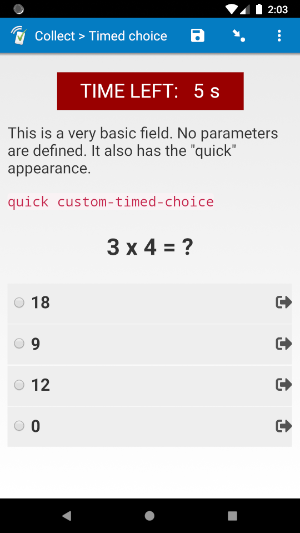

# Timed choice

  
*select_one* with "quick" *appearance*

## Description

Use this field plug-in when there should be a time limit for responding to a *select_one* or *select_multiple* question. The user will only be able to answer this question within a certain number of seconds after first arriving at the field. For example, if they leave the field while there are 15 seconds remaining, then come back 5 seconds later, there will be 10 seconds remaining on the timer.

*This plug-in is currently under beta. If you you find a problem with the field plug-in, please email support@surveycto.com, or submit an issue to this GitHub repo.*

### Features

* **Enforce a time limit on a field**  
  Specify how long a user is allowed to spend answering a question. The default is 10 seconds, but you can choose your own with parameters.
* **Enforce a time limit on a group of fields**  
  Use this field plug-in on multiple fields in a field list group to set a time limit for a group of questions.
* **Auto-advance when time runs out**  
  By default, the field will auto-advance when time runs out. You can change this behavior by adjusting the parameters.
* **Disallow changes after time runs out**  
  By default, the user will not be able to change their answer after time has run out. You can change this behavior by adjusting the parameters.
* **Disallow changes after a selection has been made**  
  By default, the user will be able to change their answer as many times as they wish until the time runs out. You can change this behavior by adjusting the parameters.
* **Specify the value to use for missed or passed answers**  
  By default, this field plug-in will choose `-99` as the answer when the time runs out. You can change this behavior by adjusting the parameters.
* **Customize the countdown timer appearance**  
  * Choose which time units to show in the countdown timer.
  * Hide the countdown timer entirely.

### Data Format

This field plug-in works with the `select_one` or `select_multiple` field types, and will return the choice value(s) of the selected choice(s). A field value is not set until either a choice is selected, or time runs out.

**Please note:** by default, this field plug-in will attempt to select the choice value `-99` when the time runs out, so you should be sure to include a choice in your choice list that has a value of `-99` (this choice will be hidden by the field plug-in). You can choose a different value to use with the `pass` parameter.

#### Metadata

This field plug-in stores the remaining time for the field in the field's metadata. You can use this if you would like to know how much time was left when the user left the field. If the `advance` parameter has a value of `1`, then the time they left the field will also be the time a choice was selected. The metadata will be a space-separated list of two items: the milliseconds remaining (regardless of the value of the `unit` parameter), and the Unix time when the user left the field.

So, if you would like to know how much time is remaining for a field named `fieldname`, use this expression in your SurveyCTO form:

    selected-at(plug-in-metadata(${fieldname}), 0)

For example, if the user left the field when there was 11,536 milliseconds remaining, then the above expression will return `11536`. To learn more about how this expression works, check out our documentation on [using expressions](https://docs.surveycto.com/02-designing-forms/01-core-concepts/09.expressions.html#plug-in-metadata).

## How to use

### Getting started

1. Download the [sample form](https://github.com/surveycto/timed-choice/raw/master/extras/sample-form/Timed%20choice.xlsx) from this repo and upload it to your SurveyCTO server.
1. Download the [timed-choice.fieldplugin.zip](https://github.com/surveycto/timed-choice/raw/master/timed-choice.fieldplugin.zip) file from this repo, and attach it to the sample form on your SurveyCTO server.
1. You can use the sample form as-is, or adjust the parameters to change the behavior (see below).

### Parameters

There are many available parameters to help you customize this field plug-in, but all of them are optional. Most likely, you will only need to set the `duration` parameter. Feel free to leave out the other parameters if their default settings work well for you.

|**Name**|**Description**|**Default**|
|---|---|---|
|`duration`|Time in seconds before the field auto-advances. No matter what unit is used for the `unit` parameter, the duration specified here should always be in seconds.|`10`|
|`unit`|The time unit to use for displaying the remaining time. For example, if there are 15 seconds remaining, and `unit` is set to `'ms'` (for milliseconds), the timer at the top of the screen will show `15000 ms`.|`'s'`|
|`disp`|Whether the timer should be displayed or not. Most of the time, this parameter does not need to be included, since the timer should almost always be displayed. However, if it should not displayed for some reason, such as if it is within a field list and not the top field, then this parameter should have a value of `0`.|`1`|
|`pass`|The value the field will be given if time runs out before an answer is given. Make sure your choice list includes a choice with this value.|`-99`|
|`advance`|Whether the field should auto-advance after time runs out. By default, when time runs out the form will automatically advance to the next field, and the user will not be able to return. If this parameter is set to `0`, then the field will not auto-advance when time runs out. *Note: see exception to this default behavior below.*|`1`|
|`block`|Whether the user can change their answer after the time runs out. By default, once the time runs out, a user will not be able to change their answer. If this parameter is set to `0`, then the user will be able to change their answer even after the time runs out.|`1`|
|`nochange`|Whether the user can change their answer after making a selection. By default, the user will be able to change their answer as many times as they wish until the time runs out. If this parameter is set to `1`, then input will be blocked as soon as a choice is selected. *Not recommended for* select_multiple *fields*.|`0`|
|`autoset`|If you are using this field plug-in purely for the timer, and there will be no actual choices to be selected (such as if it is used in a [field list](https://docs.surveycto.com/02-designing-forms/04-sample-forms/05.field-lists.html)), but you need the time remaining (as [described above](#metadata)) later in the form, use the `autoset` parameter. Give this field the same value as the `pass` parameter (in other words, give it a value of one of the choices in the choice list). That way, the field will be given a value right away, and the time remaining can be retrieved right away. If you would like a complete explanation, check out [this page]().|(blank)|

#### Available values for the `unit` parameter

|Parameter value|Unit full name|Unit in 1 second|
|:---|:---|:---|
|`'s'`|seconds|1
|`'ds'`|deciseconds|10
|`'cs'`|centiseconds|100
|`'ms'`|milliseconds|1000

*Make sure they are in single quotes, exactly as shown above.*

#### Exception to the default behavior of the `advance` parameter

The default behavior of the `advance` parameter has an exception:  if the `disp` parameter has a value of `0` (i.e., the countdown timer is hidden), then the field will not auto-advance by default. See the table below for expected behavior:

|`disp` parameter|`advance` parameter|Behavior|
|:---|:---|:---|
|(unspecified)|(unspecified)|Auto-advance after the time runs out
|`1`|(unspecified)|**Will not** auto-advance after the time runs out
|`1`|`1`|Auto-advance after the time runs out

This is because timers are usually hidden in field lists so that multiple versions of the same timer are not displayed. By also turning off the auto-advance, it ensures there are not multiple calls to move to the next field, which can cause the form to skip too far ahead.

#### Parameter examples

If you would like the field to move forward after 20 seconds, you can use this in the *appearance* column of a spreadsheet form definition:

    custom-timed-choice(duration=20)

If you would like the time to be displayed in milliseconds, you can use this in the *appearance* column of a spreadsheet form definition:

    custom-timed-choice(duration=20, unit='ms')

If you would like your *select_one* field to have the `quick` appearance, and the field duration should be 15 seconds, you can use this in the *appearance* column of a spreadsheet form definition:

    quick custom-timed-choice(duration=15)

For more examples, check out the [sample form](https://github.com/surveycto/timed-choice/raw/master/extras/sample-form/Timed%20choice.xlsx).

#### Parameters when working with field lists

In order to show a group of questions all on the same screen, with one countdown timer at the top that applies to all of them, you can create a field list group with many *select_one* and/or *select_multiple* fields, and use this field plug-in on each of them. While this is possible to do with this field plug-in, you should also consider using our [timed-field-list](https://github.com/surveycto/timed-field-list/blob/master/README.md) field plug-in, which is better-suited for this use-case. Here are some things to keep in mind when using this field plug-in with field lists:

* Except for the very first field in the field list, each field should have `disp` set to `0`. That way, the timer only appears in one place, at the top of the screen.
* All fields should have the same `duration` value. To make sure of this, it may be a good idea to store the duration value in a separate [*calculate* field](https://docs.surveycto.com/02-designing-forms/01-core-concepts/03zb.field-types-calculate.html), and then reference that value in the parameters of each of your field list fields.  
  For example, you could create a calculate field named `duration_for_timed_field_list` with a default value of `30`. Then, in the appearance column of each field in your field list, you could put `custom-timed-choice(duration=${duration_for_timed_field_list})`. That way, it is easy to keep track of and change the duration of each field in the field list.

For an example, see the group "fieldlist" in the sample form.

### Default SurveyCTO feature support

| Feature / Property | Support |
| --- | --- |
| Supported field type(s) | `select_one`, `select_multiple`|
| Default values | Yes |
| Custom constraint message | Yes |
| Custom required message | Yes |
| Read only | Yes |
| media:image | Yes |
| media:audio | Yes |
| media:video | Yes |
| `label` appearance | Yes |
| `list-nolabel` appearance | Yes |
| `quick` appearance | Yes (`select_one` only) |
| `minimal` appearance | Yes (`select_one` only) |
| `compact` appearance | No |
| `compact-#` appearance | No |
| `quickcompact` appearance | No |
| `quickcompact-#` appearance | No |
| `likert` appearance | Yes (`select_one` only) |
| `likert-min` appearance | Yes (`select_one` only) |
| `likert-mid` appearance | No |

## More resources

* **Similar alternatives**  
  * If you need to time a *text, integer,* or *decimal* field, use the [timed-advance](https://github.com/surveycto/timed-advance) field plug-in.
  * You can use this field plug-in to create a timed [field list](https://docs.surveycto.com/02-designing-forms/04-sample-forms/05.field-lists.html) (multiple fields on the same page), but also consider using our [timed-field-list](https://github.com/surveycto/timed-field-list) field plug-in, which is better-suited for this use-case.
* **Sample form**  
  You can find a form definition in this repo here: [extras/sample-form](extras/sample-form).
* **Developer documentation**  
  More instructions for developing and using field plug-ins can be found here: [https://github.com/surveycto/Field-plug-in-resources](https://github.com/surveycto/Field-plug-in-resources)
