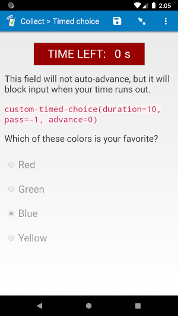
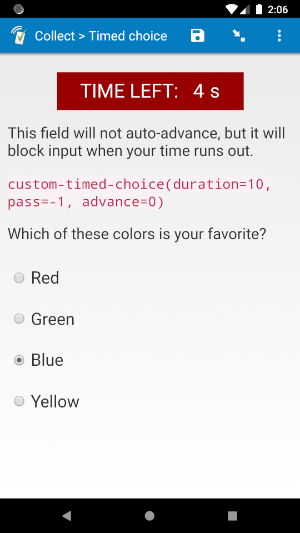
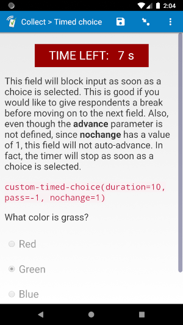

# Timed choice

  
*select_one* with "quick" *appearance*

| Time ran out | Answered | `nochange` | Milliseconds
| --- | --- | --- | --- |
|  |  |  |  |

## Description

Use this field plug-in when you would like to time a *select_one* and/or *select_multiple* field. If you need to time a *text, integer,* or *decimal* field, use the [timed-advance](https://github.com/surveycto/timed-advance) field plug-in.

If a user attempts to return to a field using this field plug-in when it has already been completed, the field will block the answers and auto-advance (this can be changed in the **Parameters**; see below for more info). If the respondent leaves the field, they can come back, the time while they are gone is still counted, and they can continue with time they have left. For example, if they leave the field while there are 15 seconds remaining, then come back 5 seconds later, there will be 10 seconds remaining on the timer.

You can use this field to create a timed [field list](https://docs.surveycto.com/02-designing-forms/04-sample-forms/05.field-lists.html) (multiple fields on the same page), but also consider using our [timed-field-list](https://github.com/surveycto/timed-field-list) field plug-in.

**Important:** You need to include a choice with the value of `-99`. This choice will be hidden by the field plug-in, but it will be selected if the time runs out without a choice selected. You can change this with the `missed` parameter.

## Default SurveyCTO feature support

| Feature / Property | Support |
| --- | --- |
| Supported field type(s) | `select_one`, `select_multiple`|
| Default values | Yes |
| Custom constraint message | Yes |
| Custom required message | Yes |
| Read only | Yes |
| media:image | Yes |
| media:audio | Yes |
| media:video | Yes |
| `label` appearance | Yes |
| `list-nolabel` appearance | Yes |
| `quick` appearance | Yes (`select_one` only) |
| `minimal` appearance | Yes (`select_one` only) |
| `compact` appearance | No |
| `compact-#` appearance | No |
| `quickcompact` appearance | No |
| `quickcompact-#` appearance | No |
| `likert` appearance | Yes (`select_one` only) |
| `likert-min` appearance | Yes* (`select_one` only) |
| `likert-mid` appearance | No |

## How to use

**To use this field plug-in as-is**, just download the [timed-choice.fieldplugin.zip](https://github.com/surveycto/timed-choice/raw/master/timed-choice.fieldplugin.zip) file from this repo, and attach it to your form.

**To use this field plug-in as-is:**

1. Download the [sample form](extras/sample-form) from this repo and upload it to your SurveyCTO server.
1. Download the [timed-choice.fieldplugin.zip](https://github.com/surveycto/timed-choice/raw/master/timed-choice.fieldplugin.zip) file from this repo, and attach it to the sample form on your SurveyCTO server.
1. Adjust the parameter if you would like to use a different unit (see below).

## Parameters
There are several parameters, but all of them are optional. The most important parameter is the `duration` parameter, but the other parameters can help you further customize the field with ease. Feel free to leave out the other parameters if their default actions work well for you.

|**Name**|**Description**|**Default**|
|---|---|---|
|`duration`|Time in seconds before the field auto-advances. No matter what unit is used for parameter 2, you should always enter the duration in seconds.|`10`|
|`unit`|Unit to be displayed for the time remaining. The time will be converted to the correct unit. For example, if the start time is 15 seconds, and the unit is `'ms'` for milliseconds, the time will be displayed at the start as `15000 ms`.|`'s'`|
|`disp`|Whether the timer should be displayed or not. Most of the time, this parameter should not be included, since the timer should almost always be displayed. Howerver, if it should not displayed for some reason, such as if it is within a field list and not the top field, then this parameter should have a value of `0`.|`1`|
|`pass`|The value the field will be given if time runs out before an answer is given. Make sure you add a choice to your choice list with this as a value.|`-99`|
|`advance`|Whether the field should auto-advance after time runs out. By default (such as if the parameter is not specified), when time runs out, the form will automatically advance to the next field, and the enumerator/respondent will not be able to return. If this parameter is equal to `0`, then the field will not auto-advance when time runs out.|`1`|
|`block`|Whether the respondent can change the selection after time runs out. By default, input will be blocked after time runs out. If this parameter is equal to `0`, then an enumerator/respondent can change the selection after time runs out.|`1`|
|`nochange`|Whether the respondent can change their answer after already selecting an answer. Normally, input will not be blocked until time runs out. If this parameter is equal to `1`, then input will be blocked as soon as a choice is selected. Not recommended for *select_multiple* fields.|`0`|

### More details

For the `unit` parameter, you can use the following display units:

|**Abbr.**|**Full name**|**Unit in 1 second**|
|:---|:---|:---|
|`s`|seconds|1
|`ds`|deciseconds|10
|`cs`|centiseconds|100
|`ms`|milliseconds|1000

Make sure they are in single quotes.

The `advance` parameter has an exception:  If the `disp` parameter has a value of `0`, then the field will not auto-advance unless the `advance` parameter has a value of `1`. This is because timers are usually hidden in field lists so that multiple versions of the same timer are not displayed. By also turning off the auto-advance, it ensures there are not multiple calls to move to the next field, which can cause the form to skip too far ahead. If the `disp` parameter has a value of `0`, and you would still like the field to auto-advance when time runs out, set `advance` to `1`.

### Examples

If you would like the field to move forward after 20 seconds, you can use this *appearance*:

    custom-timed-choice(duration=20)

If you would like the time to be displayed in milliseconds, you can use this *appearance*:

    custom-timed-choice(duration=20, unit='ms')

If the field is of type *select_one*, you would like it to have the `quick` appearance, and the field should last 15 seconds, you can use this *appearance*:

    quick custom-timed-choice(duration=15)

For more examples, check out the [sample form](extras/sample-form).

### Working with field lists

This field plug-in works well with field lists, but also consider using our [timed-field-list](https://github.com/surveycto/timed-field-list) field plug-in.

Besides the top field, each field should have a `disp` value of `0`. That way, the timer is not shown for each field. There is also no need to specify the `unit` parameter for non-top fields.

All fields should have the same `duration` value. To make sure of this, it may be a good idea to store the duration in a field (such as a static value in a [*calculate* field](https://docs.surveycto.com/02-designing-forms/01-core-concepts/03zb.field-types-calculate.html)), and then use a field reference to that field as the `duration` value for each field in the field list. That way, it is easy to keep track of and change the duration of each field in the field list.

## More resources

* **Sample form**  
You can find a form definition in this repo here: [extras/sample-form](extras/sample-form).

* **Developer documentation**  
More instructions for developing and using field plug-ins can be found here: [https://github.com/surveycto/Field-plug-in-resources](https://github.com/surveycto/Field-plug-in-resources)
